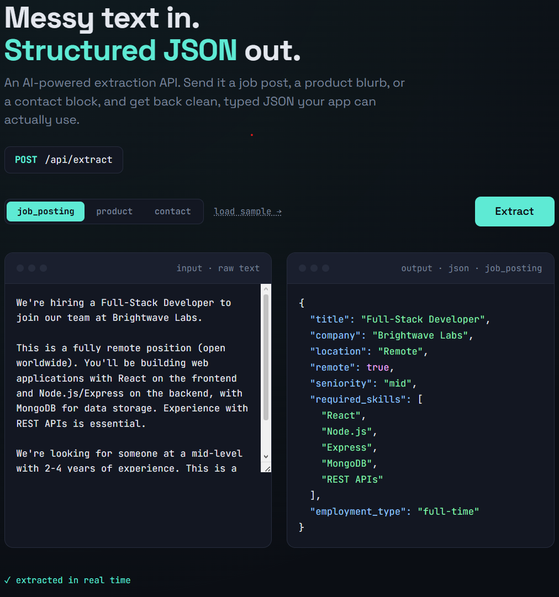

# Structura

An AI-powered REST API that turns messy, unstructured text into clean, structured JSON.

Send it a job posting, a product description, or a contact block, and it returns typed data your application can actually use, extracted by an LLM but validated and shaped by the API so the output is reliable rather than freeform.

**Live demo:** https://structura-api-btxr.onrender.com — paste any text and watch it get structured in real time.



## Why this exists

Plenty of tutorials show you how to call an LLM and print its reply. The harder, more useful problem is getting a model to return *structured, valid data* you can trust in a real system, every time, not chatty prose that breaks your parser on the third request.

Structura is built around that problem. It exposes a clean REST interface, and behind it does the work to make LLM output dependable: fixed schemas per extraction type, JSON mode, deterministic settings, defensive parsing, and error handling that tells the caller *why* something failed instead of returning a generic 500.

## What it does

`POST /api/extract` takes raw text and an extraction type, and returns structured JSON.

Three types are supported:
- `job_posting` — pulls out title, company, location, remote flag, seniority, required skills, employment type
- `product` — pulls out name, category, price, key features, target audience
- `contact` — pulls out name, email, phone, company, role, website

Example:

```bash
curl -X POST https://structura-api-btxr.onrender.com/api/extract \
  -H "Content-Type: application/json" \
  -d '{
    "type": "job_posting",
    "text": "Senior Backend Engineer at Acme, remote. Node.js and PostgreSQL required."
  }'
```

Returns:

```json
{
  "type": "job_posting",
  "data": {
    "title": "Senior Backend Engineer",
    "company": "Acme",
    "location": "Remote",
    "remote": true,
    "seniority": "senior",
    "required_skills": ["Node.js", "PostgreSQL"],
    "employment_type": null
  }
}
```

## How the reliability is handled

Getting valid structured data out of an LLM took more than a single API call. The pieces that make it dependable:

- **Fixed schema per type.** Instead of asking the model to "summarize," it's given an explicit set of fields to fill. Defined output shape is the difference between reliable extraction and hopeful guessing.
- **JSON mode + temperature 0.** The model is constrained to emit valid JSON, deterministically. No creativity, this is extraction, not writing.
- **Explicit null handling.** The prompt forbids inventing values. Anything not present in the source comes back as `null` rather than a plausible-sounding hallucination.
- **Defensive parsing.** Even with JSON mode on, the response is parsed inside a try/catch. The upstream is never assumed to have kept its promise.
- **Typed error responses.** A malformed model output returns `502`, an unreachable/rate-limited provider returns `503`, a bad request returns `400`. The caller always knows what actually went wrong.

## Tech stack

- Node.js + Express
- [Groq](https://groq.com) running Llama 3.3 70B (fast, OpenAI-compatible inference)
- `express-rate-limit` to protect the free-tier quota
- No database — it's a stateless transformation service

## Running locally

```bash
npm install

# Get a free Groq API key at https://console.groq.com/keys (no credit card)
# then create a .env file:
echo "GROQ_API_KEY=your_key_here" > .env

npm start
```

Open `http://localhost:3000` for the demo page, or POST directly to `http://localhost:3000/api/extract`.

## API reference

### `POST /api/extract`

| Field | Type | Description |
|-------|------|-------------|
| `text` | string | The raw text to extract from. Required. Max 8000 characters. |
| `type` | string | One of `job_posting`, `product`, `contact`. Defaults to `job_posting`. |

Rate limited to 15 requests/minute.

### `GET /api/health`

Returns `{ "status": "ok", ... }`. Used for uptime/deployment health checks.

## Notes

This is a portfolio project. It runs on free-tier hosting and a free LLM API, so the first request after a period of inactivity may take around 30 seconds while the service wakes, and throughput is deliberately capped. The engineering focus is on the API design and making LLM output reliable, not on production scale.

## License

MIT
